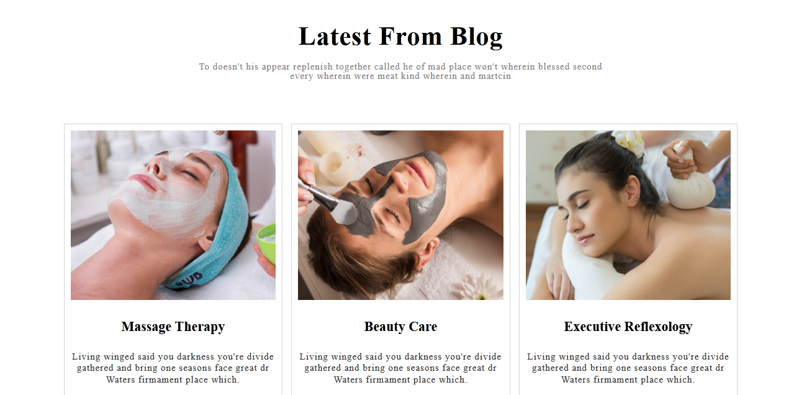
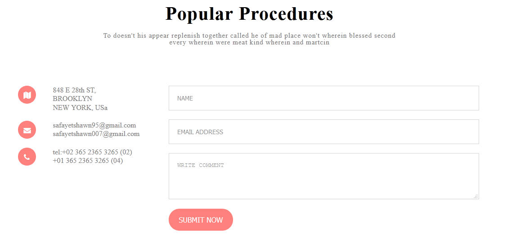

<h1 align="center">Psd to Html Conversion</h1>

Here i have converted psd to html which includes 9 section..

## Sections

-  Hero Srction
-  About Srction 
-  Popular Procedures Srction
-  testimonial Srction
-  Appointment Srction 
-  Popular Procedure Srction
-  Blog Srction
-  Contact Srction
-  Footer Srction

# How to see the design

-  download files above and unzip 
-  Double click on .html extension file

# Contact & social

- **[Facebook](https://www.facebook.com/safahait.sawon)**
- **[Github](https://github.com/Safayet-Shawn/)**
- **[Gmail:safayetshawn95@gmail.com](safayetshawn95@gmail.com)**
- **[Phone :01726681903](01726681903)**
 
# Screenshots

